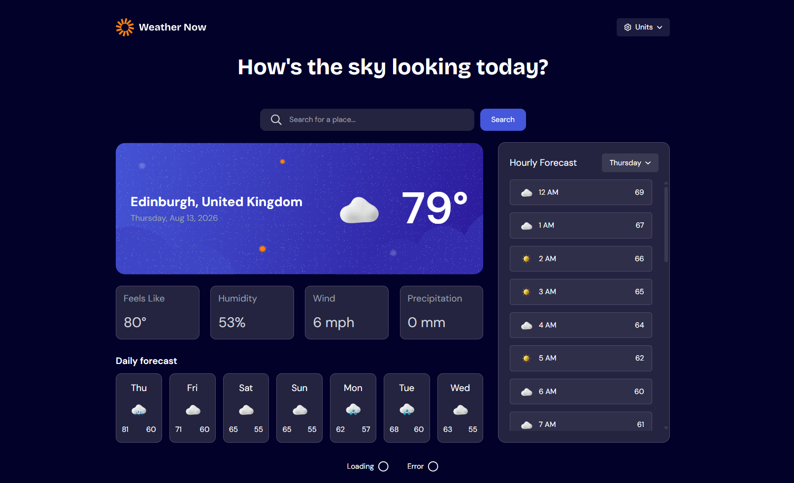
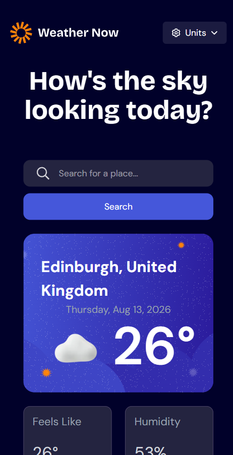
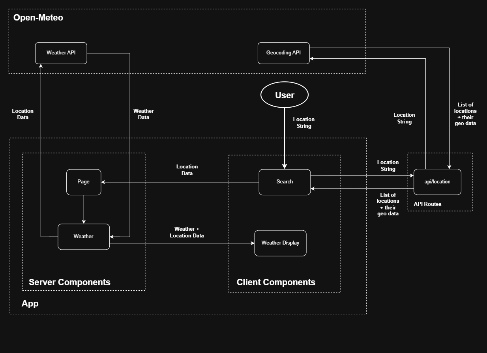

- [Overview](#overview)
- [Technologies](#technologies)
- [Features](#features)
- [How to Install](#how-to-install)
- [Data Flow](#data-flow)
- [Technical Decisions](#technical-decisions)
  - [Client and Server Components](#client-and-server-components)
  - [Caching](#caching)
  - [Suspense](#suspense)
# Overview
A responsive weather app developed with Next.js and TypeScript that allows users to search for a location and view the current weather, as well as the forecast for the next week. 
The design was taken from Frontend Mentor's Weather App challenge: `https://www.frontendmentor.io/challenges/weather-app-K1FhddVm49`




# Technologies
- Next.js
- Typescript
- Tailwind CSS
- Open-Meteo API

# Features
-  **Weather Forecast:** View the current weather, and the forecast for the next week, by hour or by day.
- **Unit Preferences:** Choose between metric or imperial units, overall or by value. Persists across sessions.
- **Loading & Error States:**  UI skeletons and progress indicators for loading states, with an error page for error handling.
- **Responsive Design:** Responsive UI for desktop, tablets and mobile. 
# How To Install
1. Clone the repository:
```bash
git clone https://github.com/Dbartmann7/weather-app-fem.git
```
2. Navigate to project folder
```bash
cd weather-app-fem
```
3. Install dependencies
```bash
npm install
```
4. Start the development server
```bash
npm run dev
```
5. Navigate to `http://localhost:3000` to view the app

# Data Flow
This diagram details the data flow from the user entering their desired location up until the weather data is shown


- The Weather Display components convert the units to match the user's unit preferences.


# Technical Decisions
### Client and Server Components

- **Decision:** Default to using Server Components and only use Client Components where client-side functionality is needed, such as interactions with the browser or user.
<br>
- **Reasoning:** Client Components require additional JavaScript to be sent to the client, increasing initial load times. By limiting their use to only components that require client-side functionality, I improved the performance of the initial page load, leading to a better experience for users with slow connections. 
<br>
- **Trade Off:** The Server/Client boundary makes moving data around the application require more thought compared to if the whole app was client-side as data cannot be directly passed up from the client to the server. I had to utilize search parameters to send the user's requested location up to the server, React Context to share user preferences between client-side components, and cookies to make the development settings accessible to the server and have them persist between refreshes.


### Caching
- **Decision:** Reduce API calls and speed up data fetch times by utilizing Next.js Cache Components to cache the weather data of a searched location, with the lifespan of each cache being 30 minutes.
<br>
- **Reasoning:** Open-Meteo uses various external weather models to provide its weather data. The models typically update their data every hour or longer, so I felt that 30 minutes was a good balance between keeping the data fresh, and reducing the number of redundant calls
<br>
- **Trade Off:** If new weather data becomes available whilst the location's cached data is still valid, the data for that location will be stale until the cached data invalidates. The maximum time a location's data will be stale due to the cache is 30 minutes, which i felt was acceptable as weather data does not change drastically in that time.

### Suspense

- **Decision:** Include the Weather API call in the top level `Weather.tsx` Component, and wrap that component in a Suspense boundary.
<br>
- **Reasoning:** Including a suspense boundary allows the user to see a loading skeleton of the page, giving the user feedback that data is being fetched rather than having no feedback. Only the `Weather.tsx` component and its children use the weather data, so it made sense that only this component should be suspended and the rest of the page should not wait for this component. 

